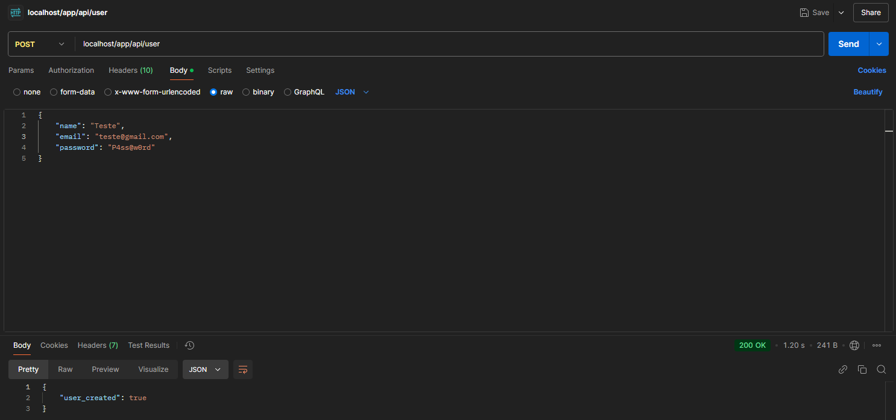
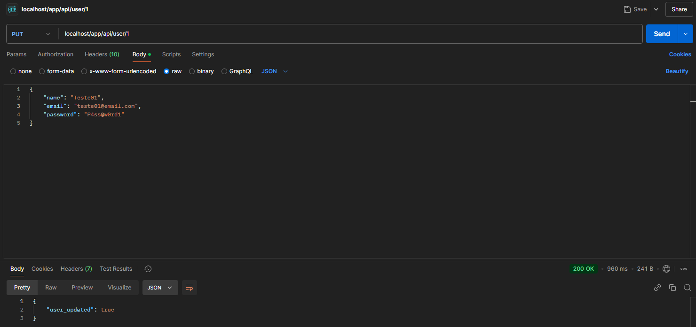
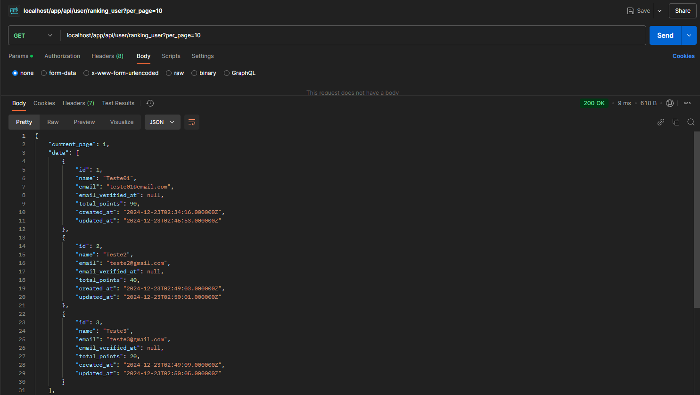
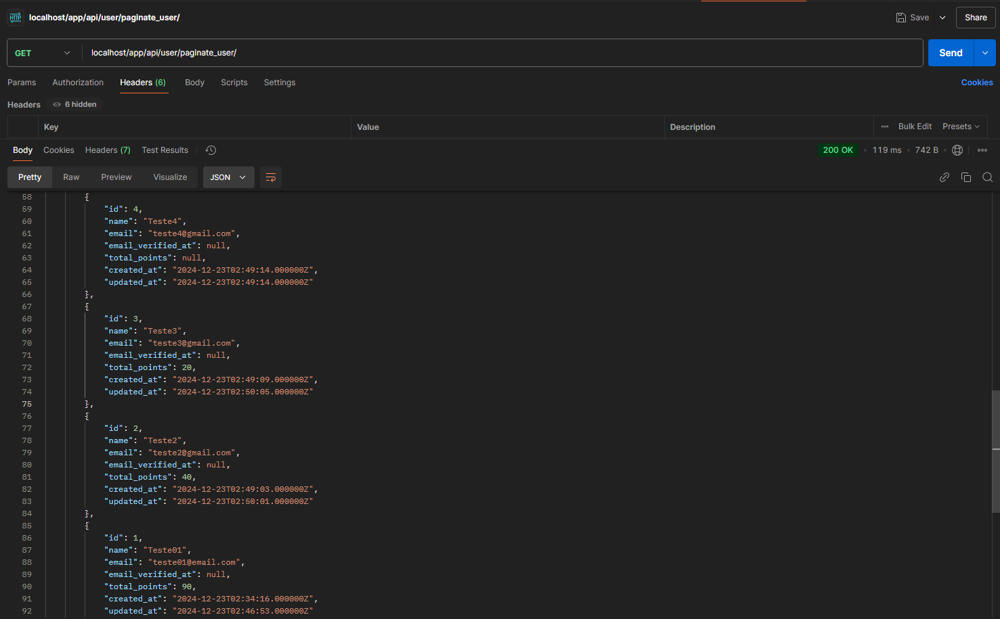
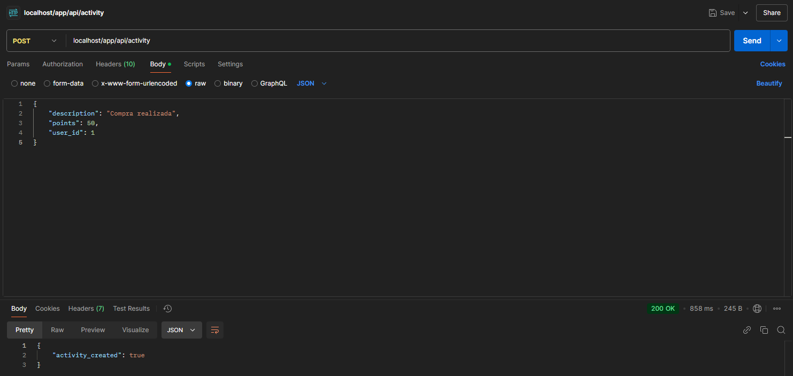
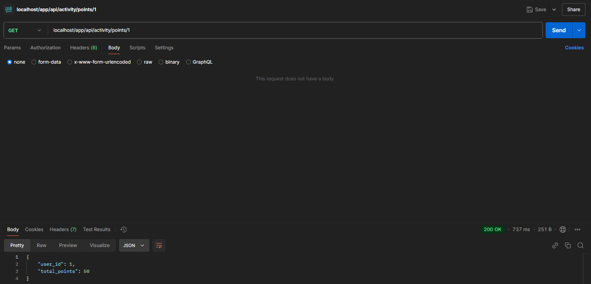
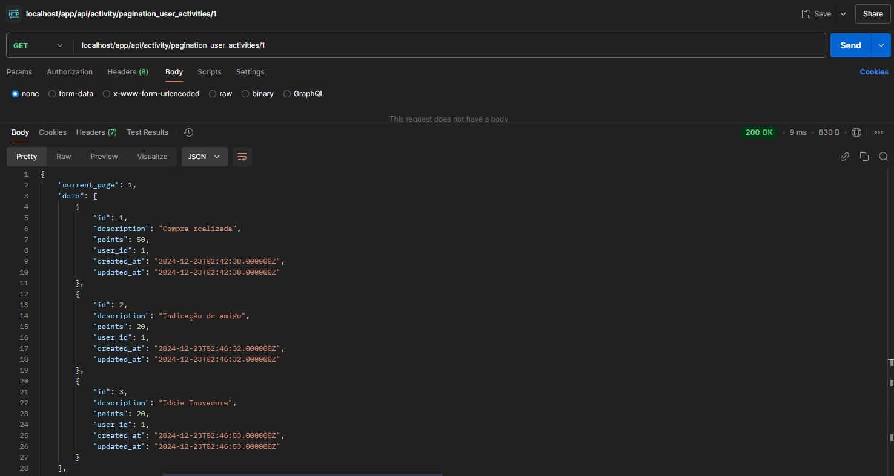

## Instrução de Execução do Projeto
Este projeto foi desenvolvido em Laravel, PHP, utilizando Docker. Seguem passos necessários para configurar e executar o projeto. 

Pré-requisitos
Antes de iniciar, certifique-se de que as ferramentas abaixo estão instaladas:
+ [Docker](https://docs.docker.com/desktop/setup/install/windows-install/).

Este comando inicializa os serviços configurados no arquivo docker-compose.yml. Ele cria e inicia os containers em segundo plano:
```
docker compose up -d
```
+ -d: Executa os containers em modo "detached" (em segundo plano).
+ Certifique-se de que não há conflitos de porta com serviços existentes no sistema.

Este comando permite que você entre no container do PHP:
```
docker compose exec -it -u user php bash
```
+ exec: Executa um comando em um container em execução.
+ -it: Permite interação no terminal do container.
+ -u user: Especifica o usuário dentro do container.
+ php: Nome do serviço PHP definido no docker-compose.yml.

Dentro do container PHP, este comando instala as dependências do projeto listadas no arquivo composer.json:
```
composer install
```
O Octane é uma biblioteca para melhorar o desempenho do Laravel. Este comando instala o Octane e solicita uma configuração durante o processo:
```
php artisan octane:install
```
+ Durante a instalação, será solicitado que você escolha um driver. Selecione swoole, que é o driver recomendado para alta performance.

Este comando instala o Chokidar, uma biblioteca Node.js para monitorar mudanças no sistema de arquivos:
```
npm install --save-dev chokidar
```
+ --save-dev: Instala a biblioteca como uma dependência de desenvolvimento.
+ Este comando deve ser executado dentro do container PHP.

A chave do Laravel é usada para criptografar dados e garantir a segurança do projeto. Este comando gera uma nova chave e a adiciona ao arquivo .env:
```
art key:generate
```

Abra o arquivo .env na raiz do projeto e configure as variáveis relacionadas ao banco de dados. Utilize as seguintes configurações para o PostgreSQL:
```
DB_CONNECTION=pgsql
DB_HOST=postgres
DB_PORT=5432
DB_DATABASE=management
DB_USERNAME=default
DB_PASSWORD=secret
```

Este comando cria as tabelas do banco de dados definidas nos arquivos de migração do Laravel:
```
php artisan migrate
```
+ Certifique-se de que as variáveis de ambiente do banco de dados estão configuradas corretamente no .env antes de executar este comando.

## Descrição dos Endpoints utilizados no projeto
+ Os usos de endpoits foram exemplificados utilizando [Postman](https://www.postman.com).
### Módulo de Usuário:
+ /user : Este endpoint é utilizado para criação de usuário.
<p align="center"><a target="_blank"></a></p>
+ /user/{userID} : Este endpoint é utilizado para atualizar o usuário cujo id é citado no {userID}.
<p align="center"><a target="_blank"></a></p>
+ /user/ranking_user : Este endpoint retorna uma paginação do ranking de 10 usuários com pontos acumulados.
<p align="center"><a target="_blank"></a></p>
+ /user/paginate_user : Este endpoint retorna todos os usuários do sistema por página.
<p align="center"><a target="_blank"></a></p>

### Módulo de Atividade:
+ /activity : Este endpoint é utilizado para criação de atividade associada a um usuário.
<p align="center"><a target="_blank"></a></p>
+ /activity/points/{userID} : Este endpoint é utilizado para listar o total de pontuação de um usuário específico cujo id é citado no {userID}.
<p align="center"><a target="_blank"></a></p>
+ /activity/pagination_user_activities/{userID} : Este endpoint é utilizado para fazer a paginação das atividades de um usuário específico.
<p align="center"><a target="_blank"></a></p>

### Para os testes da API foi utilizado o prefixo app/api configurado no arquivo /bootstrap/app.php

### Conexão com API Externa
Utilizando a API [API Random User](https://randomuser.me).
+ Para fazer a conexão com a API externa foi usado um seeder para criar usuário. Executando o seeder: database/seeders/PopulateRandomUser.php
```
art db:seed --class=PopulateRandomUser
```

### Testes Automatizados 
Para rodar os testes automatizado dos casos de uso executar o comando dentro do container PHP:
```
art test
```

### Tecnologias utilizadas no projeto:
+ Laravel
+ PHP
+ Docker
+ PostgreSQL

<p align="center"><a href="https://laravel.com" target="_blank"></a></p>

<p align="center">
<a href="https://github.com/laravel/framework/actions"></a>
<a href="https://packagist.org/packages/laravel/framework"></a>
<a href="https://packagist.org/packages/laravel/framework"></a>
<a href="https://packagist.org/packages/laravel/framework"></a>
</p>

## About Laravel

Laravel is a web application framework with expressive, elegant syntax. We believe development must be an enjoyable and creative experience to be truly fulfilling. Laravel takes the pain out of development by easing common tasks used in many web projects, such as:

- [Simple, fast routing engine](https://laravel.com/docs/routing).
- [Powerful dependency injection container](https://laravel.com/docs/container).
- Multiple back-ends for [session](https://laravel.com/docs/session) and [cache](https://laravel.com/docs/cache) storage.
- Expressive, intuitive [database ORM](https://laravel.com/docs/eloquent).
- Database agnostic [schema migrations](https://laravel.com/docs/migrations).
- [Robust background job processing](https://laravel.com/docs/queues).
- [Real-time event broadcasting](https://laravel.com/docs/broadcasting).

Laravel is accessible, powerful, and provides tools required for large, robust applications.

## Learning Laravel

Laravel has the most extensive and thorough [documentation](https://laravel.com/docs) and video tutorial library of all modern web application frameworks, making it a breeze to get started with the framework.

You may also try the [Laravel Bootcamp](https://bootcamp.laravel.com), where you will be guided through building a modern Laravel application from scratch.

If you don't feel like reading, [Laracasts](https://laracasts.com) can help. Laracasts contains thousands of video tutorials on a range of topics including Laravel, modern PHP, unit testing, and JavaScript. Boost your skills by digging into our comprehensive video library.

## Laravel Sponsors

We would like to extend our thanks to the following sponsors for funding Laravel development. If you are interested in becoming a sponsor, please visit the [Laravel Partners program](https://partners.laravel.com).

### Premium Partners

- **[Vehikl](https://vehikl.com/)**
- **[Tighten Co.](https://tighten.co)**
- **[WebReinvent](https://webreinvent.com/)**
- **[Kirschbaum Development Group](https://kirschbaumdevelopment.com)**
- **[64 Robots](https://64robots.com)**
- **[Curotec](https://www.curotec.com/services/technologies/laravel/)**
- **[Cyber-Duck](https://cyber-duck.co.uk)**
- **[DevSquad](https://devsquad.com/hire-laravel-developers)**
- **[Jump24](https://jump24.co.uk)**
- **[Redberry](https://redberry.international/laravel/)**
- **[Active Logic](https://activelogic.com)**
- **[byte5](https://byte5.de)**
- **[OP.GG](https://op.gg)**

## Contributing

Thank you for considering contributing to the Laravel framework! The contribution guide can be found in the [Laravel documentation](https://laravel.com/docs/contributions).

## Code of Conduct

In order to ensure that the Laravel community is welcoming to all, please review and abide by the [Code of Conduct](https://laravel.com/docs/contributions#code-of-conduct).

## Security Vulnerabilities

If you discover a security vulnerability within Laravel, please send an e-mail to Taylor Otwell via [taylor@laravel.com](mailto:taylor@laravel.com). All security vulnerabilities will be promptly addressed.

## License

The Laravel framework is open-sourced software licensed under the [MIT license](https://opensource.org/licenses/MIT).
